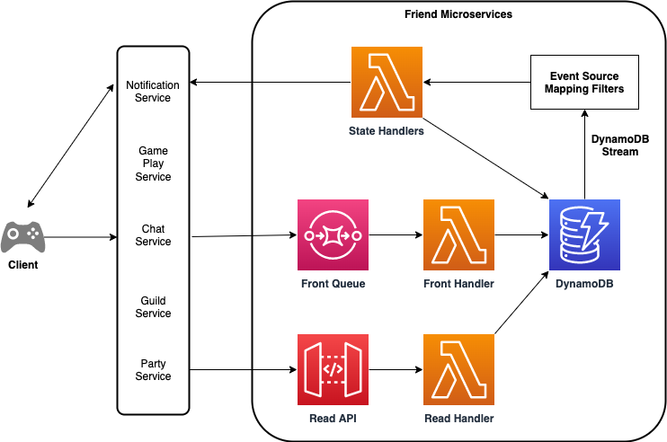

# Friend Microservices Sample

This CDK project is a sample solution for friend microservices in games.\
The sample solution contains AWS Lambda Functions, Amazon DynamoDB Tables, Amazon SQS Queues and Amazon API Gateway.

## Key features

- the solution is constructed with only serverless services
- the solution handles friend state management asynchronously
- the solution utilizes DynamoDB Streams with Event Source Mapping Filters to reduce number of transactional writes
- the solution has an SQS queue in front, so multiple backend services can send friend actions
- the solution is decoupled from player management, it simply serves friend state management
- the solution handles duplicated messages from SQS using Event Source Mapping Filters

## Assumptions

- another service, such as a notification service, has bidirectional connection with clients
- player metadata is stored separately with all player IDs matched

## Architecture

As Shown in the diagram below, there are three Lambda functions (though State Handlers are made of four lambda functions), a single SQS queues in front and a DynamoDB table.\
`Front Queue` intakes all friend actions from game backend services\
Each `State Handler` handles different state, and triggered though different Event Source Mapping Filters\
There also is an API Gateway and a Lambda Function for reading data\


## DynamoDB Tables

### Friend Table

Each entry represents friend state from the perspective of a player with the player ID against a friend with the friend ID.

| PK: player_id     | SK: friend_id     | state                | last_updated |
| ----------------- | ----------------- | -------------------- | ------------ |
| string: player ID | string: friend ID | string: friend state | time stamp   |

## Friend States

- Requested
  - State that the requester sees on his/her entry after sending a friend request
- Pending
  - State that the receiver sees on his/her entry after receiving a friend request
- Friends
  - State that both players see on their entries once they become friends

## Friend Actions

- Request
  - initial action to send a friend request to another player
- Accept
  - an action to accept a pending friend request from another player
  - this can only be triggered by the receiver
- Reject
  - an action to reject a pending friend request from another player
  - this can only be triggered by the receiver
- Unfriend
  - an action to break off a completed friend relationship between two players
  - this can be triggered by both players

## Friend Action Message

```
{
    "player_id": string,
    "friend_id": string,
    "friend_action": Friend Action,
}
```

### Prerequisites

- An AWS account
- Nodejs LTS installed, such as 18.x
- Install Docker Engine or Finch (Docker alternative for macOS)

## Usage

### Deployment

To deploy the example stack to your default AWS account/region, under project root folder, run:

1. `pnpm install` to install all the dependencies
2. `cdk deploy` to deploy this stack to your default AWS account/region

## Test

### Running Tests

To run the test suite:

```bash
pnpm test
```

Note: Tests require Docker or Finch to be running for CDK stack synthesis. If using Finch instead of Docker, the test script is already configured with `CDK_DOCKER=finch`.

### Send Test Friend Action Events

Since front SQS is Standard queue, you need to send test messages three times separately, to get to the final state.
With AWS CLI:

```
aws sqs send-message-batch --queue-url <QUEUE URL> \
 --entries file://test/testMessages<First|Second|Third>.json
```

If you want to test corner cases, try this:

```
aws sqs send-message-batch --queue-url <QUEUE URL> \
 --entries file://test/cornerCase<1|2>.json
```

### Get Test Friend Data

With `curl`:

```
$ curl -X GET 'https://<YOUR ENDPOINT>/friends/player1'
```

## License

This solution is licensed under the MIT-0 License. See the LICENSE file.

Also, this application uses below open source project,

- [aigle](https://www.npmjs.com/package/aigle)
