# Friend Microservices Sample

This CDK project is a sample solution for friend microservices in games.\
The sample solution contains AWS Lambda Functions, Amazon DynamoDB Tables, Amazon SQS Queues and Amazon API Gateway.

## Key features

- the solution is constructed with only serverless services
- the solution handles friend state management asynchronously
- the solution utilizes DynamoDB Streams with Event Source Mapping Filters to reduce number of transactional writes
- the solution has an SQS queue in front, so multiple backend services can send friend actions
- the solution is decoupled from player management, it simply serves friend state management
- the solution handles duplicated messages from SQS using Event Source Mapping Filters

## Assumptions

- another service, such as a notification service, has bidirectional connection with clients
- player metadata is stored separately with all player IDs matched

## Architecture

The system uses an event-driven architecture with DynamoDB Streams and event source mapping filters to handle friend state transitions asynchronously.

- A **Write API** (API Gateway + Lambda) accepts friend actions from the web UI and forwards them to SQS
- Game backend services can also send messages directly to the **Front Queue** (SQS)
- The **frontHandler** processes SQS messages and writes to DynamoDB
- Four **State Handlers** react to DynamoDB Stream events via filtered event source mappings
- A **Read API** (API Gateway + Lambda) serves friend list queries and isFriend checks

```mermaid
flowchart LR
    subgraph Clients
        FE["🌐 Web UI"]
        BE["🎮 Game Backend"]
    end

    subgraph Write Path
        WAPI["Write API<br/>(API Gateway)"]
        WH["writeHandler"]
        SQS["frontQueue<br/>(SQS)"]
        FH["frontHandler"]
    end

    subgraph Storage
        DDB["Friend Table<br/>(DynamoDB)"]
        STREAM["DynamoDB Stream"]
    end

    subgraph "State Handlers"
        RQH["requestStateHandler<br/>INSERT + Requested"]
        AH["acceptStateHandler<br/>MODIFY Pending→Friends"]
        RJH["rejectStateHandler<br/>REMOVE Pending"]
        UH["unfriendStateHandler<br/>REMOVE Friends"]
    end

    subgraph Read Path
        RAPI["Read API<br/>(API Gateway)"]
        RH["readHandler"]
    end

    DLQ["DLQ (SQS)"]

    FE -->|"POST /friends"| WAPI
    BE -->|"SendMessage"| SQS
    WAPI --> WH --> SQS -->|"Event Source"| FH
    FH -->|"Write"| DDB --> STREAM
    STREAM -->|"Filtered"| RQH & AH & RJH & UH
    RQH & AH & RJH & UH -->|"Write"| DDB
    RQH & AH & RJH & UH -.->|"onFailure"| DLQ
    FE -->|"GET /friends/{id}"| RAPI --> RH -->|"Query"| DDB
```



## DynamoDB Tables

### Friend Table

Each entry represents friend state from the perspective of a player with the player ID against a friend with the friend ID.

| PK: player_id     | SK: friend_id     | state                | last_updated |
| ----------------- | ----------------- | -------------------- | ------------ |
| string: player ID | string: friend ID | string: friend state | time stamp   |

## Friend States

- Requested
  - State that the requester sees on his/her entry after sending a friend request
- Pending
  - State that the receiver sees on his/her entry after receiving a friend request
- Friends
  - State that both players see on their entries once they become friends

## Friend Actions

- Request
  - initial action to send a friend request to another player
- Accept
  - an action to accept a pending friend request from another player
  - this can only be triggered by the receiver
- Reject
  - an action to reject a pending friend request from another player
  - this can only be triggered by the receiver
- Unfriend
  - an action to break off a completed friend relationship between two players
  - this can be triggered by both players

## Friend Action Message

```
{
    "player_id": string,
    "friend_id": string,
    "friend_action": Friend Action,
}
```

### Prerequisites

- An AWS account
- Node.js 22.x or later
- Install Docker Engine or Finch (Docker alternative for macOS)

## Usage

### Deployment

To deploy the example stack to your default AWS account/region, under project root folder, run:

1. `pnpm install` to install all the dependencies
2. `cdk deploy` to deploy this stack to your default AWS account/region

## Test

### Running Tests

To run the test suite:

```bash
pnpm test
```

Note: Tests require Docker or Finch to be running for CDK stack synthesis. If using Finch instead of Docker, the test script is already configured with `CDK_DOCKER=finch`.

### Web UI

After deploying, open `frontend/index.html` in your browser. Paste the Read API and Write API URLs (shown in the `cdk deploy` output) into the configuration panel, then use the two player panels to test friend workflows interactively.

### Send Test Friend Action Events

You can send friend actions via the Write API:

```bash
curl -X POST 'https://<WRITE API URL>/friends' \
  -H 'Content-Type: application/json' \
  -d '{"player_id":"player1","friend_id":"player2","friend_action":"Request"}'
```

Or send directly to SQS (for backend-to-backend scenarios):

```
aws sqs send-message-batch --queue-url <QUEUE URL> \
 --entries file://test/testMessages<First|Second|Third>.json
```

If you want to test corner cases, try this:

```
aws sqs send-message-batch --queue-url <QUEUE URL> \
 --entries file://test/cornerCase<1|2>.json
```

### Get Test Friend Data

With `curl`:

```
$ curl -X GET 'https://<YOUR ENDPOINT>/friends/player1'
```

## License

This solution is licensed under the MIT-0 License. See the LICENSE file.

Also, this application uses below open source project,

- [aigle](https://www.npmjs.com/package/aigle)
