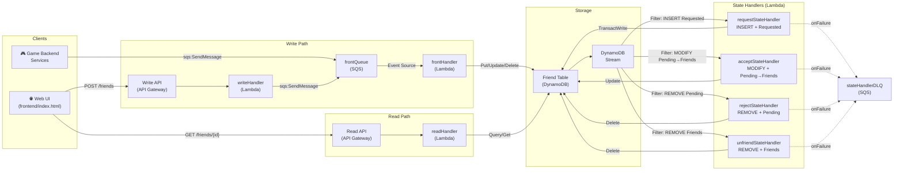

# Architecture Diagram

```mermaid
flowchart LR
    subgraph Clients
        FE["🌐 Web UI<br/>(frontend/index.html)"]
        BE["🎮 Game Backend<br/>Services"]
    end

    subgraph Write Path
        WAPI["Write API<br/>(API Gateway)"]
        WH["writeHandler<br/>(Lambda)"]
        SQS["frontQueue<br/>(SQS)"]
        FH["frontHandler<br/>(Lambda)"]
    end

    subgraph Storage
        DDB["Friend Table<br/>(DynamoDB)"]
        STREAM["DynamoDB<br/>Stream"]
    end

    subgraph "State Handlers (Lambda)"
        RQH["requestStateHandler<br/>INSERT + Requested"]
        AH["acceptStateHandler<br/>MODIFY + Pending→Friends"]
        RJH["rejectStateHandler<br/>REMOVE + Pending"]
        UH["unfriendStateHandler<br/>REMOVE + Friends"]
    end

    subgraph Read Path
        RAPI["Read API<br/>(API Gateway)"]
        RH["readHandler<br/>(Lambda)"]
    end

    DLQ["stateHandlerDLQ<br/>(SQS)"]

    FE -->|"POST /friends"| WAPI
    BE -->|"sqs:SendMessage"| SQS
    WAPI --> WH
    WH -->|"sqs:SendMessage"| SQS
    SQS -->|"Event Source"| FH
    FH -->|"Put/Update/Delete"| DDB
    DDB --> STREAM
    STREAM -->|"Filter: INSERT Requested"| RQH
    STREAM -->|"Filter: MODIFY Pending→Friends"| AH
    STREAM -->|"Filter: REMOVE Pending"| RJH
    STREAM -->|"Filter: REMOVE Friends"| UH
    RQH -->|"TransactWrite"| DDB
    AH -->|"Update"| DDB
    RJH -->|"Delete"| DDB
    UH -->|"Delete"| DDB
    RQH -.->|"onFailure"| DLQ
    AH -.->|"onFailure"| DLQ
    RJH -.->|"onFailure"| DLQ
    UH -.->|"onFailure"| DLQ
    FE -->|"GET /friends/{id}"| RAPI
    RAPI --> RH
    RH -->|"Query/Get"| DDB
```
